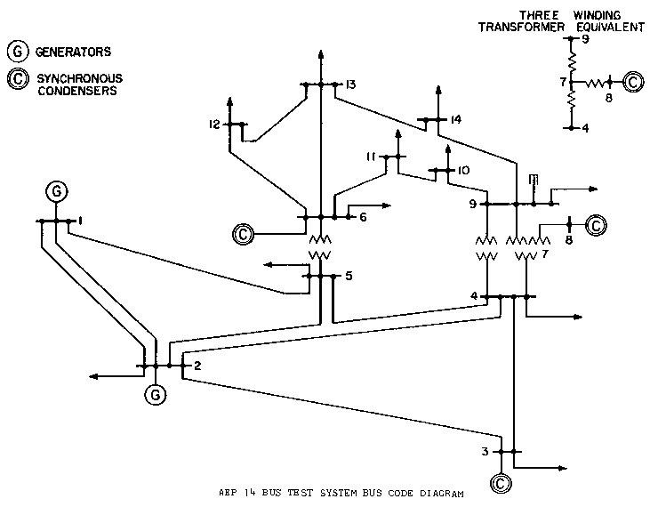

# fdlf-rs-learning-first
A repo for learning how to implement fast decoupled load flow in rust from scracth. A tutorial project.

## IEEE 14-bus

## ChatGPT suggested Step-by-step
Sure, here is a step-by-step guide on how to implement the fast decoupled load flow algorithm from scratch in Rust:

- [x] Define the data structures for the power system, including buses, branches, and loads. You can use Rust structs to represent these elements and their properties.
- [ ] Implement a function to read the power system data from a file or database and populate the data structures.
- [ ] Create a function to calculate the initial voltage and phase angle for each bus in the power system. You can use the flat start method to initialize the voltage and phase angle.
- [ ] Write a function to calculate the admittance matrix of the power system, which includes the series and shunt admittances of the branches.
- [ ] Implement the fast decoupled load flow algorithm. This involves dividing the power system into two subsystems (P and Q), and iterating between the P and Q subsystems until convergence is achieved. Here are the basic steps:
    - [ ] a. Calculate the P and Q mismatches for each bus, using the initial voltage and phase angle values. The P mismatch is the difference between the total real power injections and the total real power consumption at the bus. The Q mismatch is the difference between the total reactive power injections and the total reactive power consumption at the bus.
    - [ ] b. Update the voltage and phase angle values for the P subsystem, using the P mismatches and the series admittance matrix. This can be done using the Newton-Raphson method.
    - [ ] c. Update the voltage values for the Q subsystem, using the Q mismatches and the shunt admittance matrix.
    - [ ] d. Repeat steps a-c until convergence is achieved. You can use a convergence criterion based on the maximum P and Q mismatches.
- [ ] Once the load flow solution has converged, calculate the real and reactive power flows on each branch in the power system.
- [ ] Write a function to output the load flow results, including the bus voltages and phase angles, branch power flows, and other relevant data.

These are the basic steps for implementing the fast decoupled load flow algorithm in Rust. Of course, there may be additional details and optimizations you can add, depending on the specific requirements of your project.